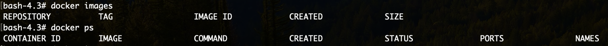
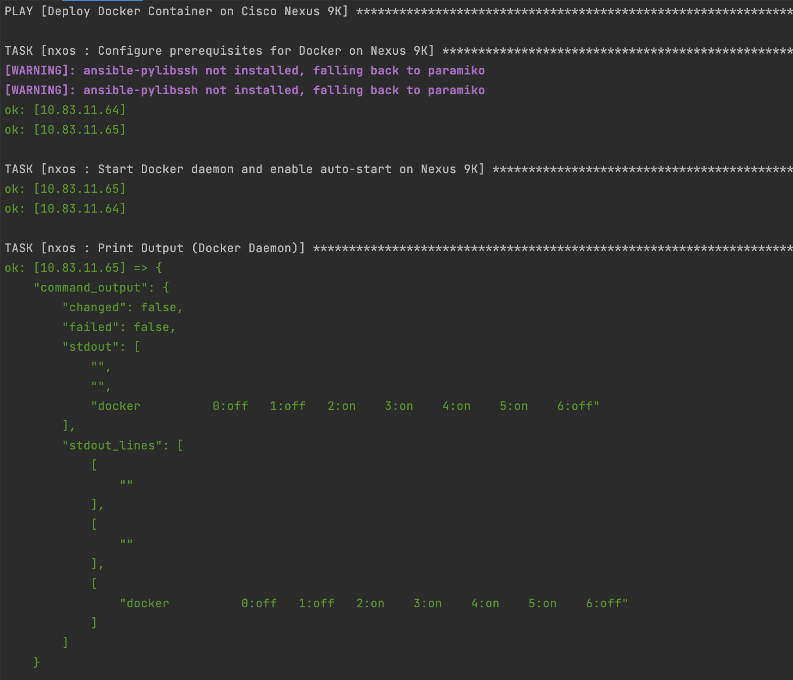
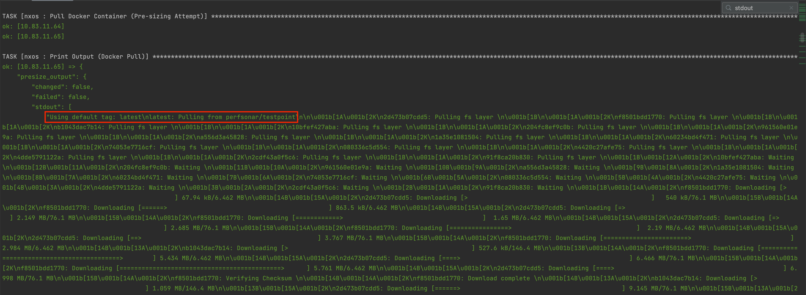
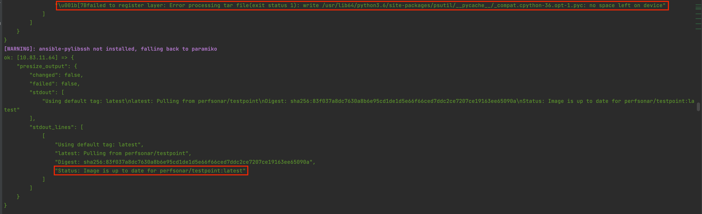
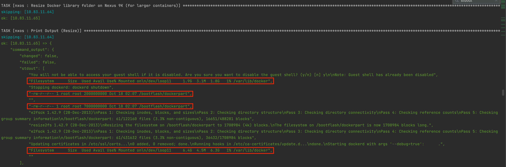
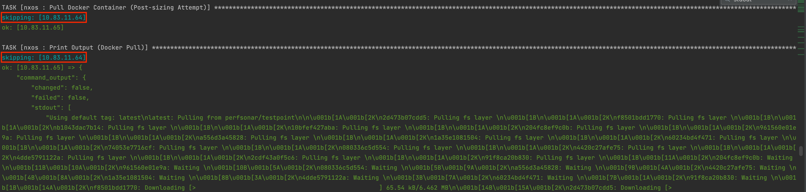
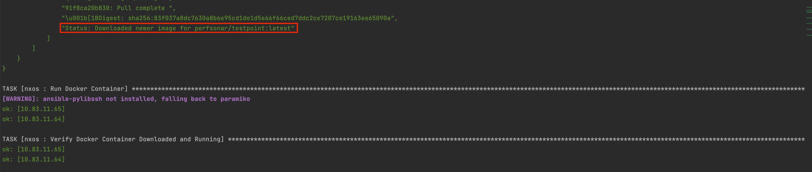
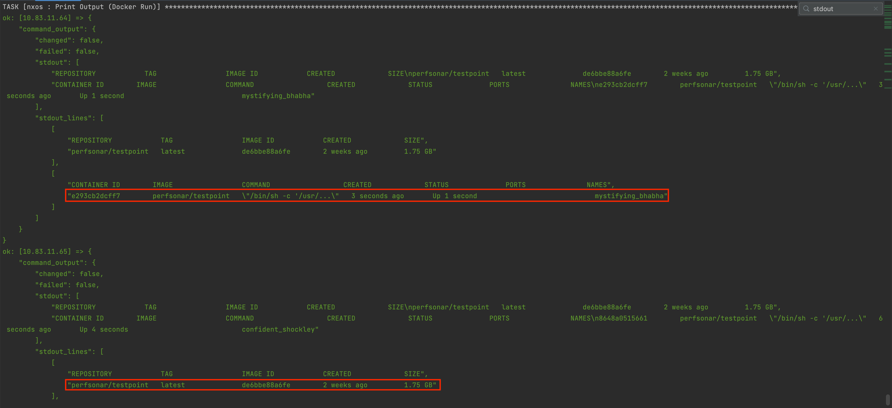
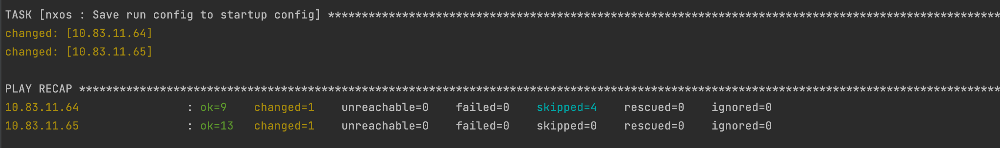
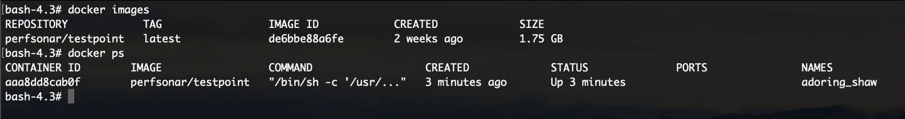

# Nexus 9000 Ansible Docker App Deployment

This playbook automates the deployment of a Docker Container to a Nexus 9000 switch using Ansible. The primary Ansible collection used in this playbook is [Cisco.Nxos](https://docs.ansible.com/ansible/latest/collections/cisco/nxos/index.html), and the playbook follows the Docker Deployment instructions detailed [here](https://www.cisco.com/c/en/us/td/docs/switches/datacenter/nexus9000/sw/93x/progammability/guide/b-cisco-nexus-9000-series-nx-os-programmability-guide-93x/b-cisco-nexus-9000-series-nx-os-programmability-guide-93x_chapter_0100001.html#id_70928).

The working example deploys the [perfSONAR](https://hub.docker.com/r/perfsonar/testpoint/) container, but the playbook can easily be modified to deploy a different container.

A high level overview of deployment steps:
* Configure Nexus Switch Prerequisites
* Start Docker Daemon
* Pull Docker Container
* Run Docker Container (optional configuration)
* Verify Deployment and Running of Container

**Note:** Some containers are too large for the initial docker disk image partition (ex: perfSONAR). This playbook includes resizing the partition following the `Resizing the Docker Storage Backend` section of the guide **if necessary**.

```
IMPORTANT: Resizing can lead to docker partition corruption. It's highly recommended to deploy a docker container manually to a switch, determine if a resize is necessary, and determine the proper amount to increase the partition by (assuming switches of the same hardware specs across switches). 
```

This project follows Ansible best practices (Roles, Variable groupings, etc.). For a detailed guide on project structure and components (plus addtional examples of NX-OS Ansible Automation), refer to this [guide](https://developer.cisco.com/docs/nexus-as-code/#!nx-os-with-ansible/step-3-setup-ansible-playbook-directory-structure).

## Contacts
* Trevor Maco

## Solution Components
* Nexus 9000
* Docker
* Ansible

## Installation/Configuration
1. Clone this repository with `git clone [repository name]`
2. Rename the `inventory_sample` file to `inventory`.
3. Add the Nexus Switch IP Addresses to the `inventory` file.
```inventory
# inventory file for Ansible playbook

[nxos]
X.X.X.X
Y.Y.Y.Y
```
```
Note: It's assumed each switch is reachable via an SSH connection.
```
4. Add the Username and Password of the admin user to `roles/nxos/vars/main.yml`. These credentials will be used for authentication to all switches specified in `inventory`.
```yaml
---
# Global Variables for NXOS Playbook
ansible_connection: ansible.netcommon.network_cli
ansible_network_os: cisco.nxos.nxos
ansible_user: <nx_os_ssh_user_username>
ansible_password: <nx_os_ssh_user_password>
```
5. (**optional**) To modify target docker image, docker container network type, or **resize partition amount**, refer to `group_vars/all`. Default values are already set. 

Other Docker Container parameters can be specified by modifying the raw CLI docker commands found in `roles/nxos/tasks/main.yml`
```all
---
# Docker specific variables
image_name: perfsonar/testpoint
network_type: host

# Enter a numeric value followed by an MB or GB
truncate_increase: 5GB
```
6. Set up a Python virtual environment. Make sure Python 3 is installed in your environment, and if not, you may download Python [here](https://www.python.org/downloads/). Once Python 3 is installed in your environment, you can activate the virtual environment with the instructions found [here](https://docs.python.org/3/tutorial/venv.html).
7. Install the requirements with `pip3 install -r requirements.txt` (**this will install Ansible via `pip`**)

## Usage

To run the playbook, use the command:

```bash
$ ansible-playbook -i inventory app_deploy.yml --extra-vars "option=<option>"
```

where `<option>` has 2 possible values:
* `check` (default): Runs show commands to check current Docker Images installed as well as running containers
* `deploy`: Runs main workflow, downloads Docker Image and spins up a Docker Container

The main playbook content is located at: `roles/nxos/tasks/main.yml` (this is where the raw commands and modules can be found). While the playbook runs, task outputs show the raw command output throughout the process. 

This example run shows deploying the perfSONAR container on **2 switches**, one with enough space and one which requires resizing.

```Before Running the Playbook:```



```Playbook Output:```










```After Running the Playbook:```




### LICENSE

Provided under Cisco Sample Code License, for details see [LICENSE](LICENSE.md)

### CODE_OF_CONDUCT

Our code of conduct is available [here](CODE_OF_CONDUCT.md)

### CONTRIBUTING

See our contributing guidelines [here](CONTRIBUTING.md)

#### DISCLAIMER:
<b>Please note:</b> This script is meant for demo purposes only. All tools/ scripts in this repo are released for use "AS IS" without any warranties of any kind, including, but not limited to their installation, use, or performance. Any use of these scripts and tools is at your own risk. There is no guarantee that they have been through thorough testing in a comparable environment and we are not responsible for any damage or data loss incurred with their use.
You are responsible for reviewing and testing any scripts you run thoroughly before use in any non-testing environment.